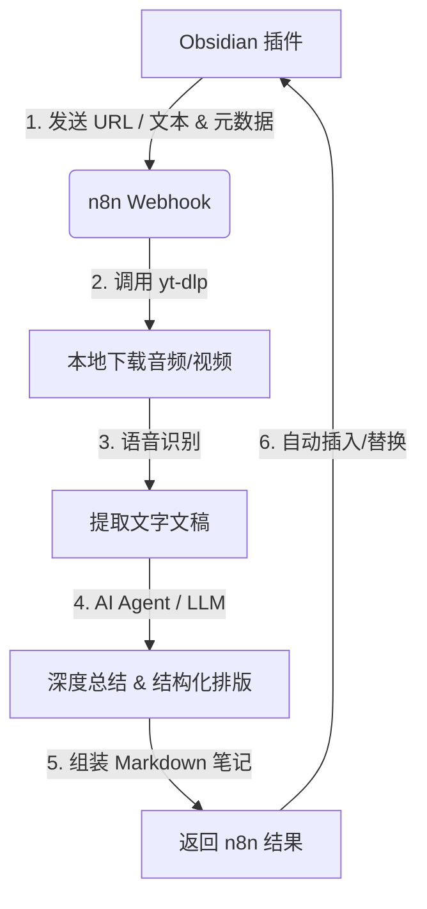

# 🎥 Obsidian Video Summary Plugin
> **Your AI-powered Video Knowledge Harvester** —— 打造你的“第二大脑”视频情报中心

---

## 💡 这不仅仅是一个插件
大多数视频总结插件只是“提取一段摘要”。本插件通过 **Obsidian ⇔ n8n 强强联合**，构建了一个完整的**高保密、全量信息提取流水线**。它可以极度完美地将长视频转化为带有结构化框架、Callouts 折叠块和精美表格的富文本笔记。

---

## 🌟 核心亮点 (Why Choose Me?)

### 🧠 极致的“第二大脑”排版哲学
不再是传统的一大段文字墙！得益于内置的多平台优化 Prompt（包含在项目附带的 `Obsidian Video Summary.json` 中），AI 将为你生成具有以下特征的极致笔记：
- **`>[!summary] 核心摘要`**：开门见山，精准定调。
- **全量提取，绝不删减**：冗长的原文推导或背景故事会用优雅的折叠块收纳，绝不丢失关键信息。
- **万物皆可表**：针对“对比”、“操作步骤”、“优劣势”自动生成精美的 Markdown 表格。
- **深度双链支持**：智能识别专业术语并进行 `[[Wikilinks]]` 连接。

### 💾 智能缓存与隔离
- **省钱省力**：相同 URL 模式组合自动触达高速缓存，避免重复调用 AI 产生高昂费用。
- **安全隔离**：批量处理支持单个文件失败不阻塞，实时查看处理进度与详细日志。

---

## 🛠️ 全量功能矩阵 (Full Feature List)

### 🎥 1. 多维度视频/文本处理
- **📺 快速总结当前笔记**：一键触达，根据笔记内的视频/音频或手动提供的文稿生成排版笔记。
- **📺 将当前笔记全文作为文稿总结**：支持**无视频场景**！将你记下的粗糙笔记发送至 AI，直接生成极致排版总结。
- **📝 快速提取文稿**：不需要总结，仅剥离视频/音频内的高精度文字稿供二次创作。
- **ℹ️ 更新视频信息（不改正文）**：仅抓取和补全视频标题、作者等 Frontmatter 属性。
- **ℹ️ 更新并重命名**：自动关联视频标题美化本地文件名，告别“未命名视频”。
- **🔗 自动多文件/录音合并总结**：在 `localFileName` 中配置逗号分隔的多个文件，插件将**逐个提取文字稿后再进行合并全量总结**（非常适合合并周期性会议录音）。

### ⚡ 2. 自动化与批量机制
- **🔄 批量处理面板 (`BatchProcessingModal`)**：灵活框选文件、指定处理模式和并发数。
- **⚡ 处理所有待处理视频**：一键扫描自动识别所有状态为 `pending` 或 `error` 的笔记，全自动化跑批！
- **⛔️ 标记为非视频笔记**：快速在属性中添加免责排除标记，防止误扫描。

### 📊 3. 视图面板与多配置管理
- **📋 侧边栏视频总结管理工作台 (`VideoSummaryView`)**：实时查看处理历史记录（成功/失败、对应模式和时间戳）。
- **🔗 多 Webhook 配置文件切换 (Multi-profile)**：可以保存、管理、并任意切换多个 n8n 节点端点，方便在“本地测试”与“云端服务”间无缝跳转。
- **🔗 测试 n8n 连接**：一键快速检测网络或节点通路异常。

---

## 🔄 架构与原理 (Architecture)

---

## 🚀 快速开始 (Quick Start)

> [!IMPORTANT]
> 本插件**必须**配合 **n8n** 服务端运行，以承担重型的音频下载、本地转文字和 AI 推理任务。

### 1. 启动 n8n 并导入工作流
1. 启动本地或 Docker 版 n8n 服务。
2. 导入项目目录中的 `Obsidian Video Summary.json` 文件。
3. 在 n8n 中填入您的 AI 模型 API Key (如 Gemini / OpenAI)。

### 2. 配置配置 Obsidian 插件
1. 给插件输入 **n8n Webhook URL** (默认为：`http://localhost:5678/webhook/obsidian-video-summary`)。
2. 配置超时时间（推荐 **10分钟**）。

更详细的操作全流程指南请参见：📖 [配置与安装指南 (INSTALL.md)](INSTALL.md)

---

## 📈 更新日志 (Changelog)

点击展开 历史版本更新

### v2.1.2
- ✨ 新增智能缓存系统
- 💰 大幅节省API调用费用
- 🔄 支持缓存管理和统计

### v2.1.1
- ✨ 新增实时批量处理功能
- 🛡️ 改进错误处理和隔离机制

### v2.1.0
- 🎉 首次发布
- 📺 基础配置和设置选项

---

## 🤝 技术支持与许可证
- 问题反馈：[Submit Issue](https://github.com/yourusername/obsidian-video-summary-plugin/issues)
- 协议：[MIT License](LICENSE)